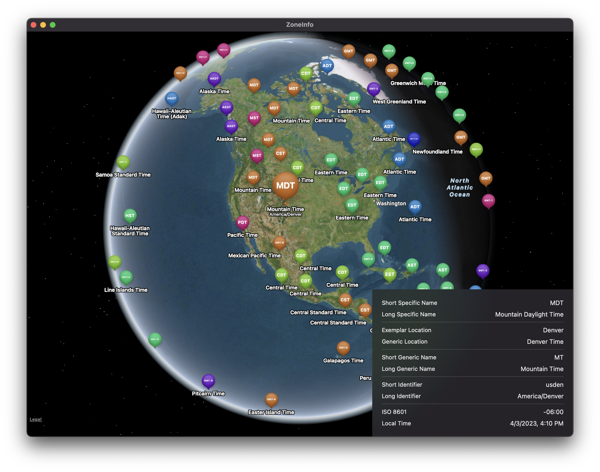
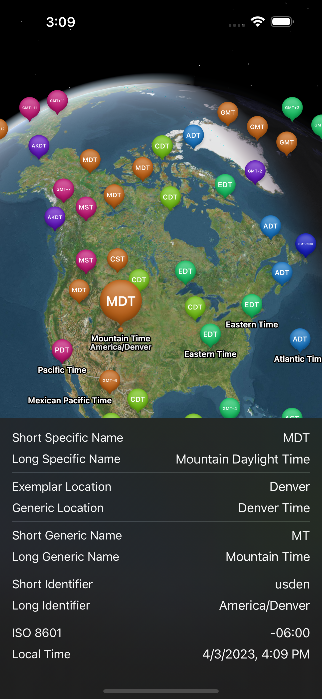

## ZoneInfo

ZoneInfo is an app for iOS, iPadOS, macOS, and visionOS to view the time zones in the system's time zone database.

The app reads from `/usr/share/zoneinfo/zone.tab` which is discussed in https://data.iana.org/time-zones/tz-link.html

Each entry in the file contains the identifier for a time zone and the coordinate of the exemplar location for that time zone.

ZoneInfo places each entry on a map as a pin- selecting a pin shows details about the time zone.
Each pin is colored by its offset from GMT so that the user may visualize regions that observe the same local time.

### Screenshots

 

